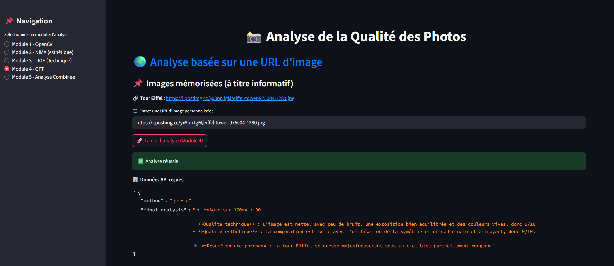

# 📷 **PoC - Système d'Analyse de Qualité des Photos**

Ce projet est un système permettant d'évaluer automatiquement la qualité des photos en analysant différents critères avec IA.

## 🖼️ Aperçu de l’application



## 🚀 **Fonctionnalités**
- 🎨 **Upload d'images** via une interface **Streamlit**
- 🌟 **Analyse automatique** de la qualité des images avec **FastAPI**
- 📊 **Critères évalués** : netteté, bruit, composition, score de qualité global
- 🧠 **Module 1 : Analyse de qualité avec OpenCV**
- 🤖 **Module 2 : Évaluation de la qualité avec NIMA (Neural Image Assessment)**
- 🤖 **Module 3 : Évaluation de la qualité avec LIQE**
- 🌟 **Module 4 : Analyse avancée avec GPT-4o (OpenAI) pour une note et un avis IA**
- 🌟 **Module 5 : Analyse combinée (OpenCV + NIMA + LIQE) avec IA (GPT-4o)** 
- 🔧 **Interface simple et intuitive** avec **Streamlit**
- 🐳 **Déploiement facile avec Docker & Docker Compose**

---

## 📂 **Structure du projet**
```
photo_quality_ai/
├── backend/          
│   ├── app/
│   │   ├── main.py    
│   │   ├── models_config.py   
│   │   ├── image_analysis.py    
│   │   ├── requirements.txt
│   │   ├── encode_image.py
│   ├── data/img
│   ├── Dockerfile
│   ├──.env
├── frontend/          
│   ├── app.py
│   ├── requirements.txt
│   ├── Dockerfile
│   │── encode_image_base64.py
├── docker-compose.yml
├── .gitignore
├── README.md
```

---

## 🛠️ **Installation et Exécution**

### 📺 **Prérequis**
- [Docker](https://www.docker.com/) et [Docker Compose](https://docs.docker.com/compose/)
- **Python 3.10+** si vous exécutez sans Docker

### 🗝️ **Configurer les variables d'environnement**
Copiez le fichier `.env.example` en `.env` dans le dossier `backend/` puis renseignez votre clé OpenAI API

### 🔧 **Lancer l'application avec Docker**
Dans le terminal, exécutez :
```bash
docker-compose up --build
```
Cela va :
- Construire et démarrer le **backend (FastAPI)** sur `http://localhost:8000`
- Construire et démarrer le **frontend (Streamlit)** sur `http://localhost:8501`

### 📂 **Arrêter les conteneurs**
```bash
docker-compose down
```

---

## 🎨 **Utilisation**
1. **Accédez à l'interface Streamlit** : [http://localhost:8501](http://localhost:8501)
2. **Chargez une image** (formats supportés : `.jpg`, `.jpeg`, `.png`)
3. **Choisissez une méthode d'analyse** :
   - **Module 1 (OpenCV)** : Analyse du flou et du bruit dans l'image
   - **Module 2 (NIMA)** : Évaluation de la qualité esthétique de l'image
   - **Module 3 (LIQE)** : Évaluation du score de qualité technique de l'image
   - **Module 4 (GPT-4o-mini - OpenAI)** : Analyse IA avancée, note finale et avis détaillé
   - **Module 5 (Analyse combinée - OpenCV + NIMA + LIQE + GPT-4o)** : Analyse complète avec IA

4. **Obtenez une analyse complète** avec des recommandations

---

## 🔍 **Détails des modules**

### **📸 Module 1 : Analyse avec OpenCV**
- Détection du **flou**
- Calcul d'un **score de qualité visuelle**
- Méthode blur **laplacienne**

### **🌟 Module 2 : NIMA (Neural Image Assessment)**
- Évaluation de la **qualité esthétique** des photos
- Bonne qualité si **≥ 5**
- Lien détail : [Modèle NIMA - Neural IMage Assessment](https://github.com/yunxiaoshi/Neural-IMage-Assessment)
- **Critères évalués par NIMA** :
  
  1️⃣ **Composition**  
  - Respect de la règle des tiers : l’image est-elle bien équilibrée ?
  - Placement du sujet : est-il bien positionné ?
  - Symétrie et alignement des éléments.
  
  2️⃣ **Luminosité et Exposition**  
  - L’image est-elle bien exposée (ni trop sombre, ni trop lumineuse) ?
  - Gestion des ombres et des hautes lumières.
  
  3️⃣ **Couleurs et Harmonie Chromatique**  
  - L’image utilise-t-elle une bonne palette de couleurs ?
  - Y a-t-il un bon contraste sans sur-saturation des couleurs ?
  
  4️⃣ **Profondeur de champ**  
  - Effet de flou d’arrière-plan bien contrôlé (bokeh).
  - Mise au point nette sur le sujet principal.
  
  5️⃣ **Émotion et Impact Visuel**  
  - L’image transmet-elle une émotion ou une ambiance forte ?
  - Engage-t-elle visuellement l’observateur ?

### **🔧 Module 3 : LIQE (Qualité Technique)**
- Analyse de la **qualité technique de l'image**
- Détection de **défauts visuels** sans référence
- Bonne qualité si **≥ 5**
- Lien détail : [Modèle LIQE - Vision-Language Correspondence](https://github.com/zwx8981/LIQE)
- **Critères évalués par LIQE** :
  
  1️⃣ **Netteté et Détails**  
  - L’image est-elle suffisamment nette ?
  - Présence de détails fins ou de textures bien définies.
  - Pas de flou excessif ni de lissage numérique.
  
  2️⃣ **Bruit Numérique et Artéfacts**  
  - Présence de grain excessif, surtout dans les zones sombres.
  - Compression JPEG visible (blocs, pixels anormaux).
  
  3️⃣ **Contraste et Dynamique**  
  - L’image a-t-elle un bon contraste naturel ?
  - Plage dynamique bien exploitée (pas de zones totalement brûlées ou bouchées).
  
  4️⃣ **Distorsion et Aberration Chromatique**  
  - Pas de distorsion optique ou d’effets de "fish-eye".
  - Pas d’artefacts colorés en bordure des objets.
  
  5️⃣ **Balance des Blancs et Fidélité des Couleurs**  
  - Les couleurs sont-elles naturelles et bien restituées ?
  - Pas de dominante de couleur indésirable.

### **🤖 Module 4 : Analyse IA avec GPT-4o (OpenAI)**
- Analyse avancée basée sur l'**intelligence artificielle**
- OpenAI examine l'image et les scores des autres modules
- **Note finale sur 100** et **avis détaillé**
- Recommandations pour améliorer la qualité de l'image

### **🌟 Module 5 : Analyse combinée**
- Combinaison des modules 1, 2 et 3
- Analyse approfondie de la qualité visuelle et technique
- Intégration de **l'IA GPT** pour un avis final
- Note finale fournie par OpenAI (sur 100)

---

## 🔍 **Développement**
Si vous souhaitez exécuter les services **manuellement** sans Docker :

### 1⃣ **Démarrer le backend (FastAPI)**
```bash
cd backend/app
pip install -r requirements.txt
uvicorn main:app --host 0.0.0.0 --port 8000
```

### 2⃣ **Démarrer le frontend (Streamlit)**
```bash
cd frontend
pip install -r requirements.txt
streamlit run app.py --server.port 8501 --server.address 0.0.0.0
```

---

## 📝 **Licence**
Ce projet est sous licence MIT - voir le fichier [LICENSE](LICENSE) pour plus de détails.

---

🚀 **Créé avec ❤️ par JimmyCodeur** 🎉

